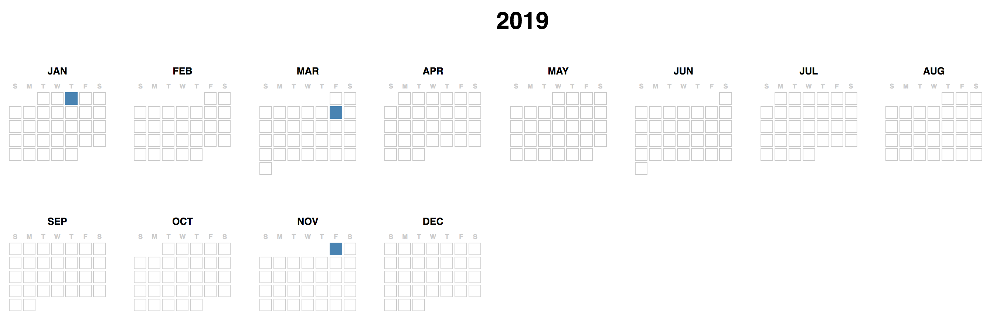

# 🗓 Calendarize

Some Python to generate a small multiple calendar duder for events in a given year, like this:



## Usage
I'm using Python 3.7 with [pipenv](https://pipenv.readthedocs.io/en/latest/) to manage the one dependency ([Jinja](http://jinja.pocoo.org)).

To render the "hello world" example:
1. Clone or download/unzip this repo
2. `cd` into the directory
3. `pipenv install`
4. `pipenv run python calendarize.py`

### `calendarize.py`
This file ingests a CSV of dates to highlight on the calendar -- example at `data.csv` -- mashes 'em up with a thing keeping track of days for the given year and then passes the data along to template (`template.html`) to render into your final output file, `calendar.html`. The four variables up top you might want to change:
- `YEAR`: The calendar year you want to display
- `DATA_FILE`: The CSV of events you want to highlight
- `TEMPLATE`: The name of the template file
- `OUTFILE`: What you want to name the file built from the rendered template

### `data.csv` (or whatever you call your data file)
The script assumes that your CSV will have at least two columns with the date in the first column in `YYYY-MM-DD` format and the text of the event in the second, like this:
```
date,event
2019-01-03,something is happening
2019-03-08,something else is happening
2019-11-01,something else else is happening
```

### `template.html`
Edit this file to change the HTML layout -- [here are the Jinja docs](jinja.pocoo.org/docs/latest/) -- along with `styles.css` to change how stuff looks. Right now I'm just dumping the event text into the `title` attribute of the `td`, but do whatever moves you.